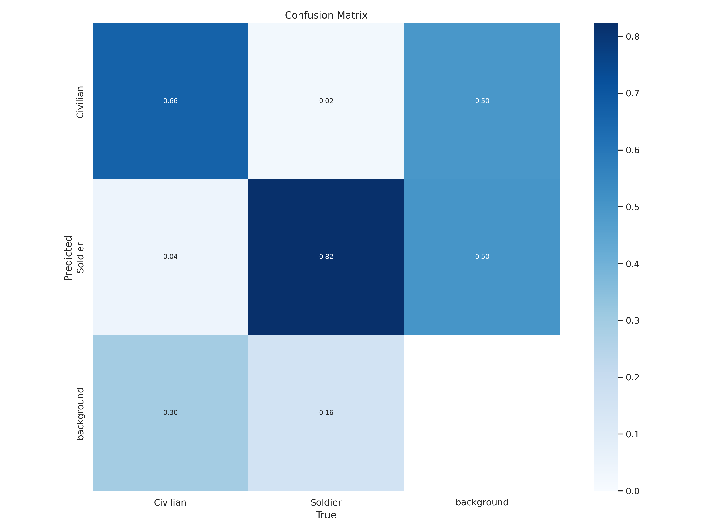
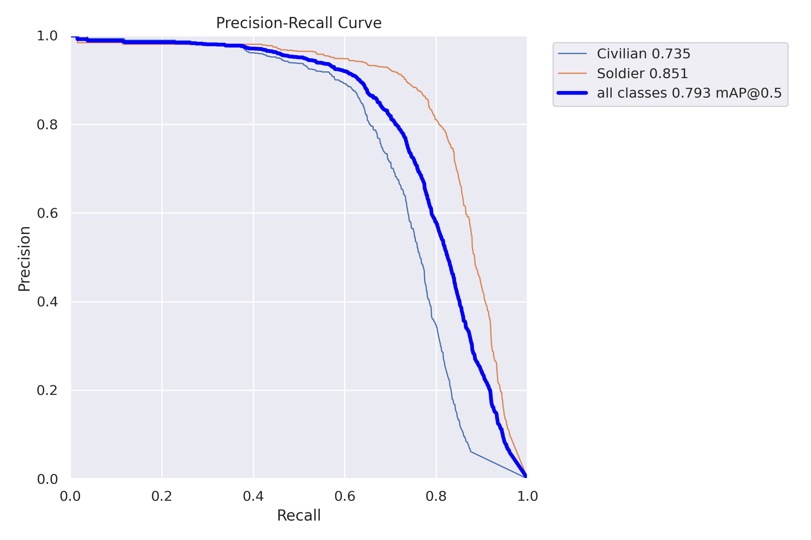
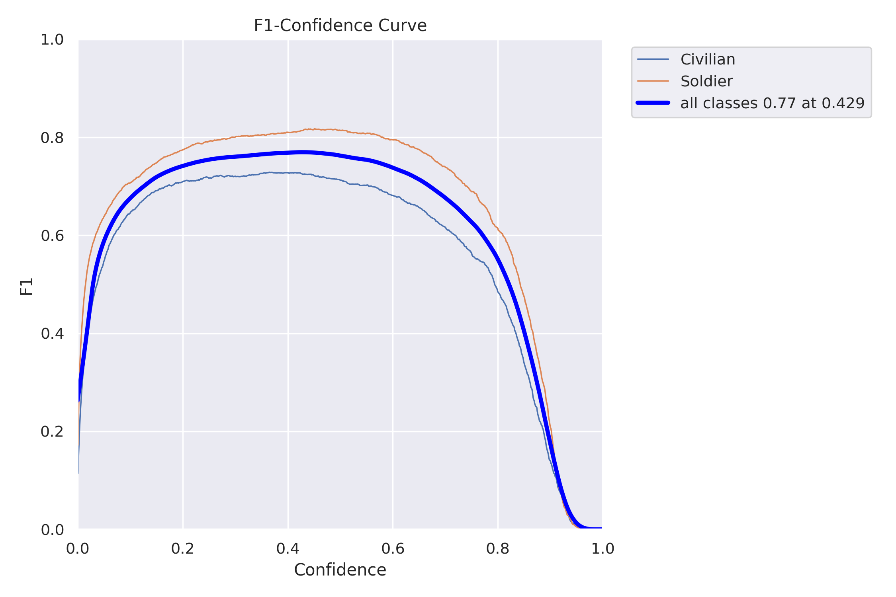
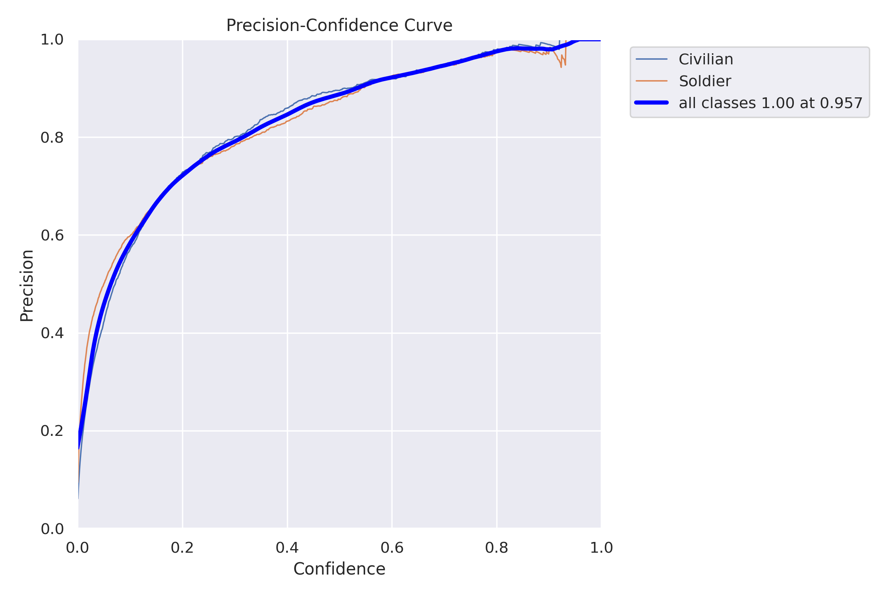
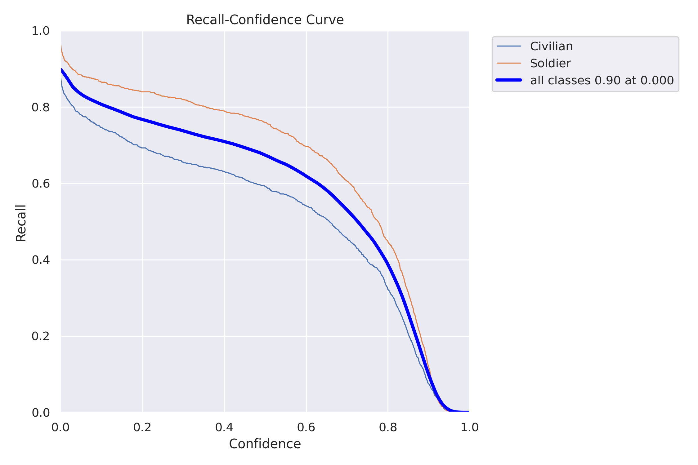
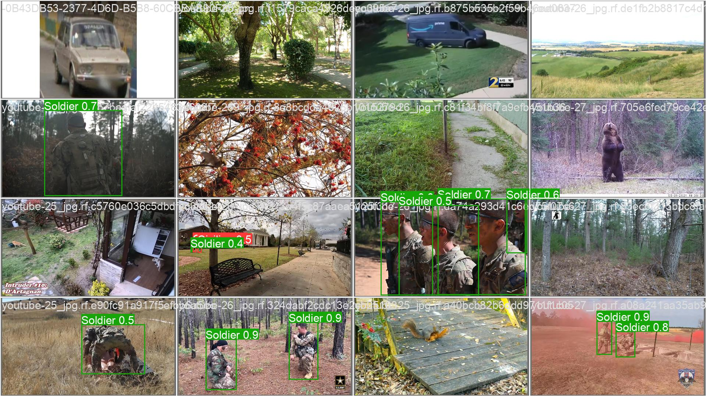
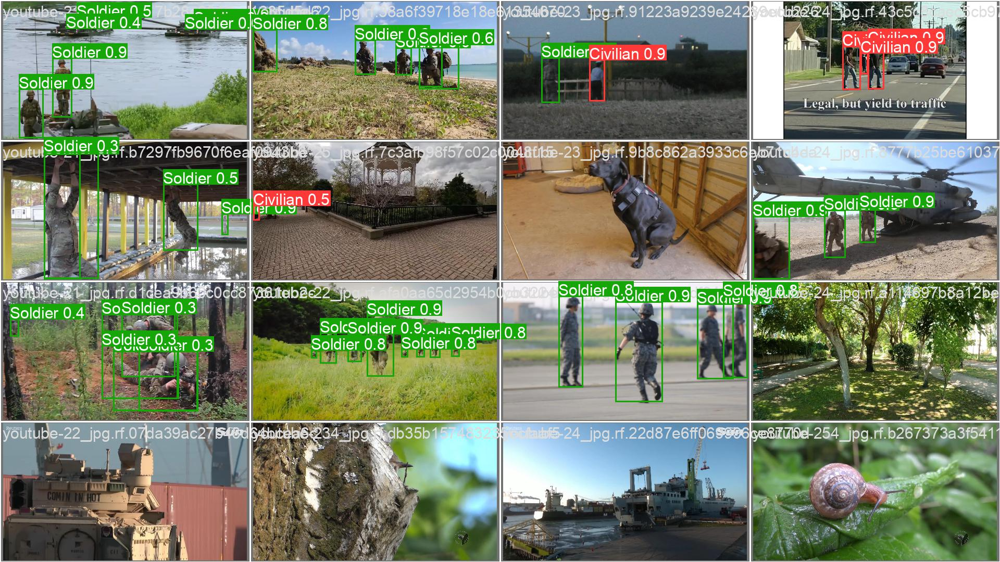
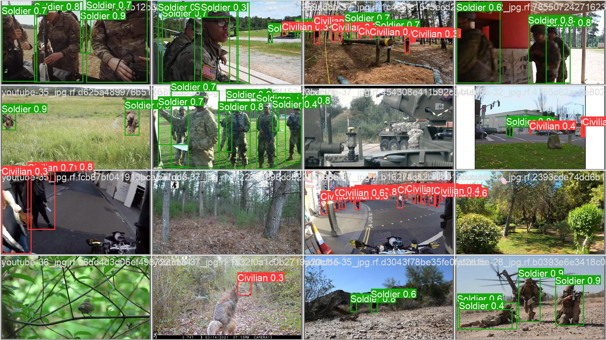

# Object Tracker

This project implements an object tracking system using YOLO (You Only Look Once) and DeepSORT algorithms for real-time object detection and tracking in video streams.

## Features

- Real-time object detection using YOLO
- Object tracking using DeepSORT algorithm
- Performance validation and metrics visualization
- Support for video input and output

## Requirements

- Python 3.7+
- scikit-learn==0.21.0
- tensorflow==2.11.0
- scikit-image==0.19.3
- filterpy==1.4.5

## Installation

1. Clone the repository:
```bash
git clone [your-repository-url]
cd Object-Tracker
```

2. Install the required dependencies:
```bash
pip install -r requirement.txt
```

## Usage

Run the main script:
```bash
python main.py
```

## Validation Results

The model's performance is validated using various metrics:

### Confusion Matrix


### Precision-Recall Curve


### F1 Score Curve


### Precision Curve


### Recall Curve


### Sample Validation Results




## Demo Video

A sample tracking result can be found in `test_result.mp4`, which demonstrates the system's ability to track objects in real-time.

## Project Structure

- `main.py`: Main entry point for the application
- `tracker.py`: Implementation of the tracking algorithm
- `deep_sort/`: DeepSORT implementation
- `ultralytics/`: YOLO implementation
- `images/`: Contains validation and performance metrics
- `Inferences/`: Directory for inference results

## Acknowledgments

- YOLO: https://github.com/ultralytics/yolov8
- DeepSORT: https://github.com/nwojke/deep_sort